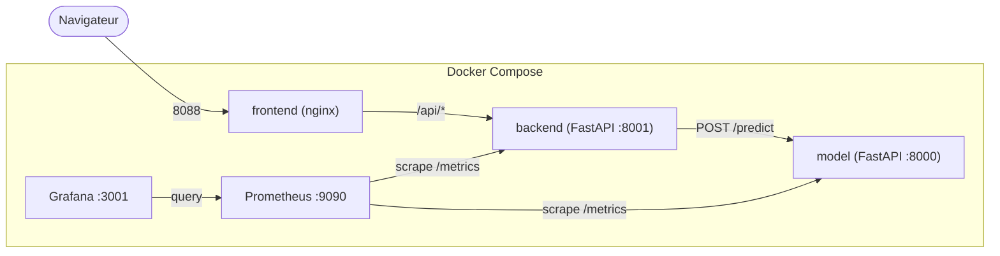
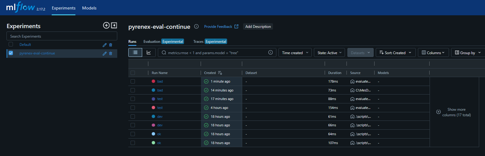
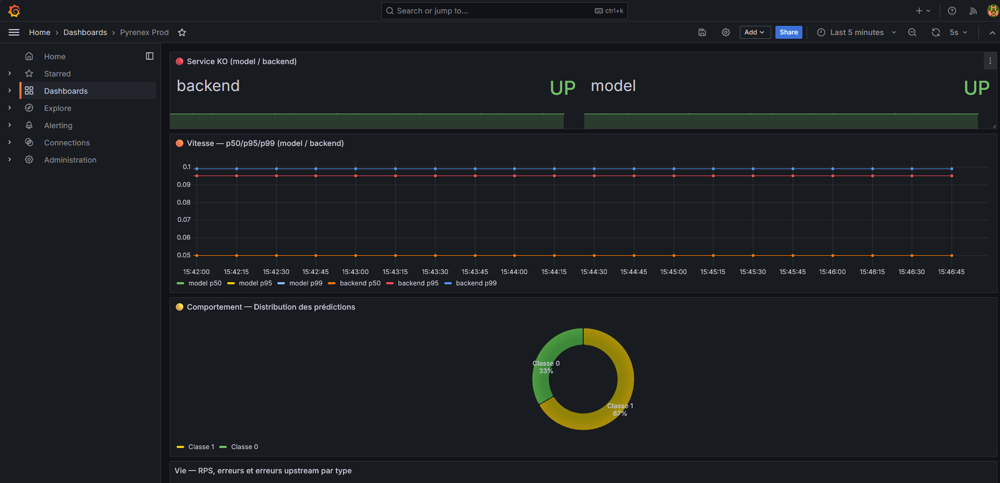

# README Romain

## 🧭 Architecture



## 🚀 3 commandes pour démarrer

```bash
# 1. Cloner et se placer dans le repo
git clone https://github.com/joellegermanos-prog/M5-B1-Romain_Joelle.git
cd M5-B1-Romain_Joelle

# 2. Lancer les 3 services + monitoring (build inclus)
docker compose up --build

# 3. Vérifier que tout est sain
docker compose ps
```

Accès une fois lancé : frontend [http://localhost:8088](http://localhost:8088),
backend [http://localhost:8001](http://localhost:8001), model [http://localhost:8000](http://localhost:8000).

## 🧪 Commandes utiles de validation et d’évaluation

### Tests API / contrat du modèle

```powershell
# tests du service model
python.exe -m pytest -q services/model/tests

# tests du garde-fou d’évaluation continue
python.exe -m pytest -q tests/test_evaluation.py
```

### Geler la baseline de référence (golden run)

```powershell
python.exe scripts/evaluate_model.py --freeze-baseline
```

### Évaluer une release

```powershell
python.exe scripts/evaluate_model.py --release-tag v2.0.0
python.exe scripts/evaluate_model.py --release-tag test
```

### Simuler une regression pour tester le blocage

```powershell
python.exe scripts/evaluate_model.py --release-tag bad --degrade
```

> Le script doit sortir en code non nul si les seuils sont violés. C’est ce comportement qui bloque la release dans GitHub Actions.

### Comparer les runs MLflow

```powershell
mlflow.exe ui
```

Puis ouvrir <http://localhost:5000> pour voir les métriques et comparer les runs de validation continue.


## 📦 Image sur GHCR

Image `model` publiée sur GitHub Container Registry :
[github.com/joellegermanos-prog/M5-B1-Romain_Joelle/pkgs/container/m5-b1-romain_joelle%2Fmodel](https://github.com/joellegermanos-prog/M5-B1-Romain_Joelle/pkgs/container/m5-b1-romain_joelle%2Fmodel)

## 📊 Grafana local

Dashboard accessible sur [http://localhost:3001](http://localhost:3001).

Vue du dashboard "Pyrenex Prod" :


